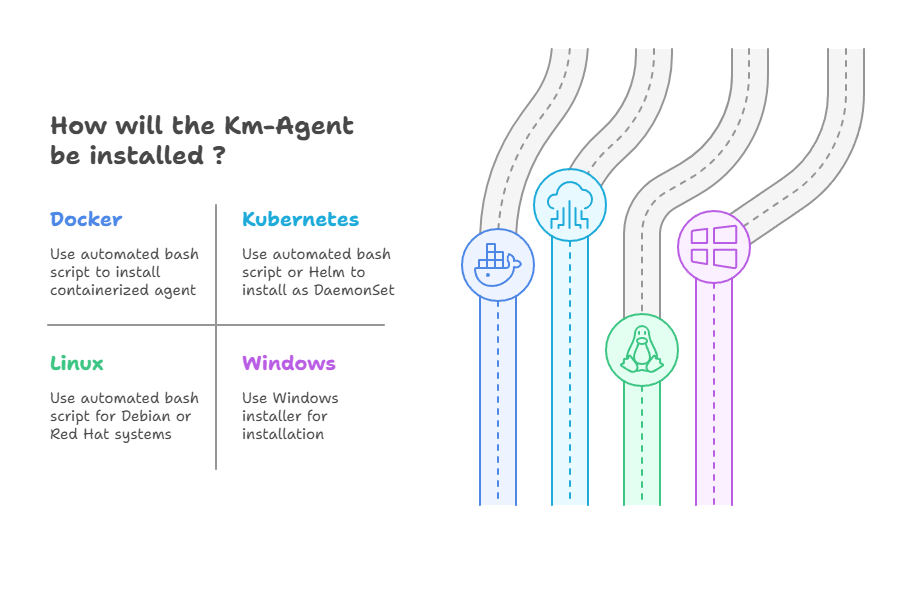

<div align="center">


[](https://opensource.org/licenses/Apache-2.0)
[](https://golang.org/)
[](https://github.com/kloudmate/km-agent/releases)
[](https://github.com/kloudmate/km-agent/actions)

[](https://img.shields.io/badge/dynamic/json?url=https%3A%2F%2Fghcr-badge.elias.eu.org%2Fapi%2Fkloudmate%2Fkm-agent%2Fkm-kube-agent&query=downloadCount&style=flat&logo=docker&label=Image%20Pulls&color=2496ed)

**KloudMate Agent — An OpenTelemetry Collector Distribution**

*An OpenTelemetry Collector distribution with automated deployment, remote configuration, eBPF-powered zero-code observability, and auto-instrumentation support*
</div>

## About

**KM-Agent is an [OpenTelemetry Collector distribution](https://opentelemetry.io/docs/concepts/distributions/)** that extends the upstream OpenTelemetry Collector with additional capabilities for simplified deployment, remote configuration management, automated instrumentation, and **eBPF-powered kernel-level observability**. We've bundled a curated set of components optimized for observability in Kubernetes, Linux, Docker, Windows environments, and even on Edge.

### Key Problems Solved

- **Complex Configuration**: Eliminates the steep learning curve of OpenTelemetry Collector configuration
- **Manual Installation**: Provides automated installation scripts for multiple environments
- **Configuration Management**: Enables remote configuration through a web interface without SSH access
- **Blind Spots in Observability**: Using eBPF get instant, zero-code visibility across all services — no SDK integration, no code changes, no restarts
- **Database Visibility**: Built-in Database Activity Monitoring (DAM) captures SQL operations, latencies, and throughput at the kernel level

## Features

- 🚀 **Automated Installation**: One-command deployment across Linux, Docker, and Kubernetes
- 🌐 **Remote Configuration**: Configure agents through a web interface without your target machine access
- 📊 **Lifecycle Management**: Comprehensive management of OpenTelemetry Collector
- 🔍 **Synthetic Monitoring**: Built-in health checks and monitoring capabilities
- 🎯 **Multi-Platform Support**: Native support for various deployment environments (including ARM64)
- 📈 **Real-time Dashboards**: Unique agent identification for centralized monitoring
- 🐝 **eBPF-Powered Observability**: Kernel-level, zero-code instrumentation for instant application and network visibility
- 🛢️ **Database Activity Monitoring (DAM)**: Automatic profiling of MySQL, PostgreSQL. Even messaging systems like Redis, Kafka etc.
- ⚡ **Zero Downtime Instrumentation**: Observe all services without code changes or application restarts

### Supported OpenTelemetry Components

The KloudMate Agent includes a set of OpenTelemetry Collector components including receivers, processors, exporters, and extensions. For a complete list of all supported components with description and documentation links, see the [Supported Components Documentation](internal/shared/COMPONENTS.md).

### Installation

Choose your environment and run the appropriate installation command:

#### Docker Installation
Docker agent is containerized version of the Agent that collect host level metrics (via `hostmetricreceiver`) and logs (via the volume mounts)
User can install the agent by running below script

```bash
KM_API_KEY="<YOUR_API_KEY>" KM_COLLECTOR_ENDPOINT="https://otel.kloudmate.com:4318" bash -c "$(curl -L https://cdn.kloudmate.com/scripts/install_docker.sh)"
```

#### Linux Installation
The agent supports both Debian and Red Hat based systems on **x86_64** and **ARM64 (aarch64)** architectures.
Packages are available as `.deb` (Debian/Ubuntu) and `.rpm` (RHEL/CentOS/Fedora).

Install the agent via the automated bash script:

```bash
KM_API_KEY="<YOUR_API_KEY>" KM_COLLECTOR_ENDPOINT="https://otel.kloudmate.com:4318" bash -c "$(curl -L https://cdn.kloudmate.com/scripts/install_linux.sh)"
```

Bash script should have various configurable arguments to configure the agent apart from API_KEY which is required for authentication at exporter. Each of the script should have corresponding uninstall command to remove the agent from the system.

#### Kubernetes Installation
- The agent will run as DaemonSet as well as a Deployment in the cluster and add necessary components to monitor the nodes and pods.
- you must install `kloudmate-crd` before running helm install command:

```bash
 kubectl apply -f https://raw.githubusercontent.com/kloudmate/km-agent/refs/heads/develop/deployment/helm/km-kube-agent/crds/crd-otel-instrumentation.yaml
```

You can then install the agent using below Helm commands
```bash
helm repo add kloudmate https://kloudmate.github.io/km-agent
helm repo update
helm install kloudmate-release kloudmate/km-kube-agent --namespace km-agent --create-namespace \
--set API_KEY="<YOUR_API_KEY>" \n --set COLLECTOR_ENDPOINT="https://otel.kloudmate.com:4318" \
--set clusterName="<YOUR_CLUSTER_NAME>" \
--set "monitoredNamespaces={MONITORED_NS}" \
--set featuresEnabled.apm=true \
--set featuresEnabled.logs=true
```
##### ⚠️NOTE:
- For the `monitoredNamespaces` flag the namespaces should be passed as comma-separated values. For example - `--set "monitoredNamespaces={bookinfo,mongodb,cassandra}"` where `bookinfo`,`mongodb` and `cassandra` are the targetted namespaces that you want to monitor.

> 🚨 **Note:** For private GKE clusters, you will need to either add a firewall rule that allows master nodes access to port `9443/tcp` on worker nodes, or change the existing rule that allows access to port `80/tcp`, `443/tcp` and `10254/tcp` to also allow access to port `9443/tcp`. More information can be found in the [Official GCP Documentation](https://cloud.google.com/load-balancing/docs/tcp/setting-up-tcp#config-hc-firewall). See the [GKE documentation](https://cloud.google.com/kubernetes-engine/docs/how-to/private-clusters#add_firewall_rules) on adding rules and the [Kubernetes issue](https://github.com/kubernetes/kubernetes/issues/79739) for more detail.


**Note**: To enable APM (Application Performance Monitoring) and logs collection, set the `featuresEnabled.apm` and `featuresEnabled.logs` flags to `true`. By default, metrics and traces are enabled. You can customize these settings based on your monitoring requirements:
- `featuresEnabled.apm=true` - Enables application performance monitoring
- `featuresEnabled.logs=true` - Enables log collection
- `featuresEnabled.metrics=true` - Enables metrics collection (enabled by default)
- `featuresEnabled.traces=true` - Enables trace collection (enabled by default)

⚠️ **Configuration Management**: Manually updating the ConfigMaps for the DaemonSet or Deployment agents is **not recommended**, as these configurations may be overwritten by updates sent from KloudMate APIs. The recommended approach is to use the **KloudMate Agent Config Editor** - a web-based YAML editor that ensures your configurations are properly synchronized and persisted across your infrastructure.

#### Installing the Agent on Nodes with Taints
If your Kubernetes cluster uses taints on nodes, the agent daemonset pods must have corresponding tolerations to be scheduled successfully. By default, the agent does not apply any tolerations. You can configure tolerations during installation using Helm parameters.
The helm installation command in this case will look like this - 
```bash
helm install kloudmate-release kloudmate/km-kube-agent --namespace km-agent --create-namespace \
--set API_KEY="<YOUR_API_KEY>" --set COLLECTOR_ENDPOINT="https://otel.kloudmate.com:4318" \
--set clusterName="<YOUR_CLUSTER_NAME>" \
--set "monitoredNamespaces={MONITORED_NS}" \
--set tolerations[0].key="env" --set tolerations[0].operator="Equal" --set tolerations[0].value="uat" --set tolerations[0].effect="NoSchedule" \
--set tolerations[1].key="env" --set tolerations[1].operator="Equal" --set tolerations[1].value="sb-uat-node" --set tolerations[1].effect="NoSchedule" \
```
In the above example, two tolerations are provided to match the taints configured on the cluster’s nodes. This ensures the agent daemonset pods can be scheduled across all desired nodes.

#### Notes
- You can define as many tolerations as needed by incrementing the index (`tolerations[0]`, `tolerations[1]`, etc.).
- The values of key, operator, value, and effect should match the taints applied to your nodes.
- If your cluster has no taints, you can skip these parameters. By default, the agent daemonset pods will be automatically scheduled on untainted nodes.

### Windows Installation
Download and run the Windows (.exe) installer from our [releases page](https://github.com/kloudmate/km-agent/releases).


## Supported Environments



### Current Support
- ✅ **Linux** (Debian/Ubuntu, RHEL/CentOS) — x86_64 and ARM64 (aarch64)
- ✅ **Docker** (Host metrics and log collection)
- ✅ **Kubernetes** (via DaemonSet & Deployment)
- ✅ **Windows** (Windows Server 2016+)


### Architecture
Agent is installed as service on the host system/docker container/demonset on a k8s. It is done during installation process. The agent is responsible for managing the lifecycle of the Collector. The Agent is not an implementation of Collector, instead, it runs and manages lifecycle of existig OTel Collector.


It is also primarily responsible for watching remote configuration (via REST endpoint) and pass on the configuration to Collector when changes has been detected. It has other functionalities such as synthetic monitoring that can be used to monitor the agent's status, various logs for monitoring purpose etc.

Each agent is uniquely identifyable so it can be used to build dashboard for the user to monitor the agents and configure them using a web interface.


### Kubernetes Agent Architecture


The Kubernetes agent runs as a Deployment & DaemonSet and includes:
- **Node Monitoring**: CPU, memory, disk, and network metrics
- **Pod Monitoring**: Container-level metrics and logs
- **Cluster Events**: Kubernetes events and resource monitoring
- **Service Discovery**: Automatic service endpoint detection

In future releases the agent can be installed in any of the following environments as well:
* Mac
* ECS
* Azure k8s

---

## eBPF Receiver — Zero Downtime Observability

The KM-Agent ships with a built-in **eBPF (Extended Berkeley Packet Filter) Receiver** that provides instant, out-of-the-box observability for your entire infrastructure and application stack — **without requiring code changes, manual configurations, or application restarts**.

eBPF runs programs safely inside the Linux kernel, allowing the agent to observe the behaviour of the entire system and its applications dynamically at extremely low overhead.

### What It Provides Out of the Box

| Capability | Description |
| :--- | :--- |
| **Golden RED Metrics** | Automatic Request Rate, Error Rate, and Duration metrics. Protocols supported: HTTP/HTTP2, gRPC, MySQL, PostgreSQL, Redis, MongoDB, Kafka, Elasticsearch. |
| **Auto-Distributed Tracing** | Automatically connects incoming requests to outgoing calls, generating fully compliant OpenTelemetry trace spans across microservices. |
| **Service Metadata & Inventory** | Auto-detects application language, enriches data with Host IDs, Process IDs, Cloud Provider metadata, and Kubernetes attributes. |
| **Zero-Code Network Observability** | Captures L3/L4 network flow metrics including bytes transferred, TCP retransmits, state changes, and packet drops between services. |

### eBPF vs. Traditional OpenTelemetry

| Feature | KM eBPF Receiver | Traditional OpenTelemetry |
| :--- | :--- | :--- |
| **Code Changes** | **None.** Deploy the agent to the node. | Requires SDK dependencies or attaching agents. |
| **Application Restarts** | **No restarts required.** | Requires rolling restarts to inject instrumentation. |
| **Setup Complexity** | **Low.** Single DaemonSet / VM process per host. | **High.** Per-service configuration, library updates. |
| **Language Support** | **Universal.** Go, Rust, C++, Python, Java, Node.js, Ruby. | Requires per-language SDKs; compiled languages are difficult. |
| **Performance Overhead** | **Extremely low.** Runs in kernel space. | Higher, especially with rich auto-instrumentation. |
| **Missing Services** | Impossible — the kernel sees every packet. | Un-instrumented services remain blind spots. |

> **💡 Recommended approach:** Start with the eBPF Receiver for instant, broad coverage, then strategically enrich with Traditional OpenTelemetry SDKs where you need custom business logic attributes.

### Enabling the eBPF Receiver

The eBPF Receiver is enabled through the agent's `config.yaml`. Below is a standard configuration:

```yaml
metrics:
  features:
    - application          # HTTP, gRPC, SQL operation metrics (RED metrics)
    - application_span     # Trace spans for transactions
    - network              # L3/L4 Network flow metrics

discovery:
  services:
    - name: all-services
      namespace: default
      open_ports: '80, 443, 8080, 8443, 5432, 3306, 6379, 9092, 27017'

network:
  enable: true
  source: tc
  direction: both

attributes:
  kubernetes:
    enable: true
```

#### Prerequisites
- Linux kernel >= 5.8 (recommended; some features work on 4.18+)
- Root privileges or `CAP_SYS_ADMIN` + `CAP_BPF` capabilities
- In Kubernetes: RBAC permissions (Node, Pod, Service, ReplicaSet viewers)

---

## Database Activity Monitoring (DAM)

The eBPF Receiver includes built-in **Database Activity Monitoring** that automatically profiles database traffic at the kernel level. No database-side agents or plugins needed.

### Supported Databases
| Database | Captured Metrics |
| :--- | :--- |
| **MySQL** | Query operations, latency (avg + P99), prepared statements, read/write ratio |
| **PostgreSQL** | Query operations, latency (avg + P99), prepared statements, read/write ratio |

| Messaging Systems | Captured Metrics |
| :--- | :--- |
| **Redis** | Command operations, latency, throughput |
| **Kafka** | Producer/Consumer metrics, throughput |
| **Elasticsearch** | Request operations, latency, throughput |

### Key DAM Capabilities
- **Table-level hotspot detection** — identify your most queried and slowest tables
- **Read vs. Write ratio analysis** — understand workload characteristics per table
- **P99 latency tracking** — surface tail latency issues before they impact users
- **Zero configuration** — automatically detected via eBPF kernel hooks; no database credentials required

Enable heuristic SQL detection and tune caches for high-load environments:

```yaml
ebpf:
  heuristic_sql_detect: true
  mysql_prepared_statements_cache_size: 1024
  postgres_prepared_statements_cache_size: 1024
```

---

<div align="center">

## Latest Enhancement to Your KloudMate Suite
### Introducing  **KloudMate Templates** - Curated Templates for Every Use Case
[](https://templates.kloudmate.com)
#### Click [here](https://templates.kloudmate.com) or the above image to see available templates
</div>

### Reporting Issues

Before creating an issue, please:

- Check existing [issues](https://github.com/kloudmate/km-agent/issues)
- Provide detailed reproduction steps
- Include environment information(K8s version,VM host info, OS, etc.)

## Community and Support

### Getting Help

- 📧 **Email**: support@kloudmate.com
- 🐛 **[Issues](https://github.com/kloudmate/km-agent/issues)** - Bug reports and feature requests
- 💻 **[Documentation](https://docs.kloudmate.com)**

### Community Resources

- 🌟 **[Dashboard Templates](templates.kloudmate.com)**
- 📝 **[Blog Posts](https://blog.kloudmate.com)**
- 📱 **[Slack Community](https://kloudmate.slack.com)**


## License

This project is licensed under the [Apache License 2.0](LICENSE). See the LICENSE file for full details.

## Acknowledgments

-  **OpenTelemetry Community** - For the foundational observability framework
---

<div align="center">

**Made with 🧡 by the KloudMate Team**

[Website](https://kloudmate.com) • [Documentation](https://docs.kloudmate.com/kloudmate-agents) • [Community](https://github.com/kloudmate/km-agent/discussions) • [Support](mailto:support@kloudmate.com)

</div>
